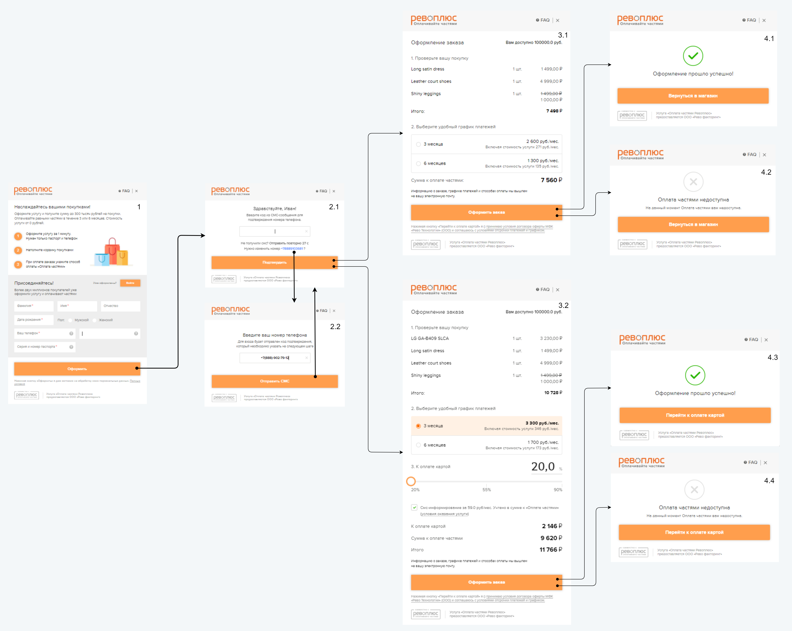
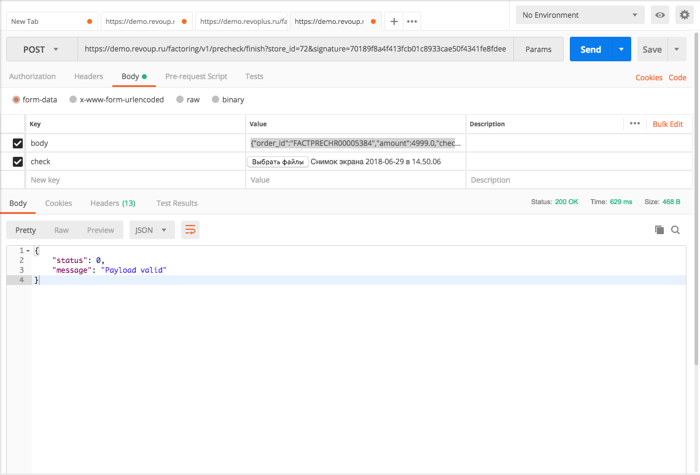

# Introduction

API Factoring is based on the HTTPS protocol with JSON queries.

The documentation consists of 4 main parts:


* Authorization description, <a href="#api">API methods</a> and <a href="#cb76858662">error codes</a>.
* <a href="#iframe-revo">Revo iFrame description</a>.
* <a href="#5a291e242a">Visualisation on a partner website</a>.
* <a href="#db947828e5">Test manual</a>.

# Authorization

## Base URL addresses

```javascript
BASE_URL = "https://r.revoplus.ru/"
BASE_URL = "https://demo.revoplus.ru/"
```

1. To interact with Revo services, two base addresses are used:
 * https://r.revoplus.ru/ - the `production` address of the service.
 * https://demo.revoup.ru/ - the `demo` address of the service.
2. `BASE_URL` - переменная обозначающая базовый адрес.

<aside class="notice">
The connection is only supported via HTTPS protocol - when trying to connect via HTTP, error 404 will occur.
</aside>

## Authorization parameters

> Parameters example

```javascript
secret_key = "098f6bcd4621d373cade4e832627b4f6"
STORE_ID1 = 12
STORE_ID2 = 13
```

1. On Revo’s side a unique store identifier and a secret key are generated, which are transferred to the partner:
 * `store_id` - unique store identifier. In most cases, at least two unique identifiers are generated: `STORE_ID1` is used for `Registration` and `Limit` methods. `STORE_ID2` - for all the other methods.
 * `secret_key` - a secret key used when generating the digital signature for authentication of query parameters to protect the form from being launched by third parties. Key length is 8 bytes. Encryption algorithm is SHA1.
2. For authorization, the partner sends POST query, using digital signature and unique store identifier `store_id`.
3. Examples of URL queries can be found in <a href="#api">API Methods</a> section.

## Digital signature generation

> Algorithm of digital signature generation

```ruby--tab
require 'digest/sha1'
secret_key = '9fff8c602b08b00323567be0001480f6'
data = "{\"order_id\": \"FACTPRECHR152632\", \"amount\": \"8300.00\"}"
SIGNATURE = Digest::SHA1.hexdigest(data + secret_key)
```

> The result of the encryption in the above example is "cbfb21630cd585f59c3a50fc3365d8c26b97cd4e".

```java
import java.io.UnsupportedEncodingException;
import java.security.MessageDigest;
import java.security.NoSuchAlgorithmException;
import java.util.Formatter;

public class Main {

    static String secret_key = "098f6bcd4621d373cade4e832627b4f6"; // Это пример
    static String data = "{\"callback_url\":\"https://shop.ru/revo/decision\",\"redirect_url\":\"https://shop.ru/revo/redirect\",\"current_order\":{\"sum\":\"7500.00\",\"order_id\":\"R001233\"},\"primary_phone\":\"9268180621\"}";

    public static void main(String[] args) {

        String signature = encryptPassword(data + secret_key); // Тут всегда будет 40 символов по SHA1
        System.out.println(signature);
    }

    private static String encryptPassword(String password) {
        String sha1 = "";
        try {
            MessageDigest crypt = MessageDigest.getInstance("SHA-1");
            crypt.reset();
            crypt.update(password.getBytes("UTF-8"));
            sha1 = byteToHex(crypt.digest());
        } catch(NoSuchAlgorithmException e) {
            e.printStackTrace();
        } catch(UnsupportedEncodingException e) {
            e.printStackTrace();
        }
        return sha1;
    }

    private static String byteToHex(final byte[] hash) {
        Formatter formatter = new Formatter();
        for (byte b : hash) {
            formatter.format("%02x", b);
        }
        String result = formatter.toString();
        formatter.close();
        return result;
    }
}
```

A secret key `secret_key` is added to an escaped (adding `\` in front of `"` and `\`) json body `data` string. SHA1 algorithm is then used to the generate a string which forms a digital `signature`.

<aside class="notice">
Please note, that the signature length will always be 40 symbols according to SHA1.
</aside>

# API Methods

## Registration

```ruby
POST BASE_URL/factoring/v1/limit/auth?store_id=STORE_ID1&signature=SIGNATURE
```

The method returns a URL to the iFrame in order to get the client's limit. Upon completion of the form a json response with information about client's limit is sent to the address specified in `callback_url`.

Depending on the information about the user in the Revo system the form will have a different number of steps (`primary_phone` has to be specified) - see more info on <a href="#iframe-revo">REVO iFrame description</a>.

<aside class="success">
The personal data provided by the client on the partner's website should be sent in the query for autocompletion of the corresponding Revo iFrame data fields.
</aside>

### Parameters

> Json query example

```jsonnet
{
  "callback_url": "https://shop.ru/revo/decision",
  "redirect_url": "https://shop.ru/revo/redirect",
  "primary_phone": "9268180621",
  "primary_email": "ivan@gmail.com",
  "current_order":
  {
    "order_id": "R001233"
  },
  "person":
  {
    "first_name": "Петр",
    "surname": "Чернышев",
    "patronymic": "Александрович",
    "birth_date": "15.01.1975"
  }
}
```

| | | |
-:|-:|:-|:-
 |**callback_url**<br> <font color="#939da3">string</font> | <td colspan="2"> URL for Revo response with information about client's limit.
 |**redirect_url**<br> <font color="#939da3">string</font>	| <td colspan="2"> URL for redirecting upon clicking the button "Return to online store” in the Revo form.
 |**current_order**<br> <font color="#939da3">object</font> | <td colspan="2"> An object containing information about the order.
<td colspan="2" style="text-align:right">**order_id**<br> <font color="#939da3">string</font> | | Unique order number. Maximum 255 characters. A unique random string can be used.
 |**primary_phone**<br> <font color="#939da3">string, *optional*</font> | <td colspan="2"> Client’s phone number consisting of 10 digits (omitting the country code).
 |**primary_email**<br> <font color="#939da3">string, *optional*</font> | <td colspan="2"> Client’s email.
 |**person**<br> <font color="#939da3">object, *optional*</font> | <td colspan="2"> The object containing information about the client.
  <td colspan="2" style="text-align:right">**first_name**<br> <font color="#939da3">string, *optional*</font> | |	Client’s name.
  <td colspan="2" style="text-align:right">**surname**<br> <font color="#939da3">sring, *optional*</font> | | Client’s surname.
  <td colspan="2" style="text-align:right">**patronymic**<br> <font color="#939da3">string, *optional*</font> | | Client's patronymic.
  <td colspan="2" style="text-align:right">**birth_date**<br> <font color="#939da3">object, *optional*</font> | | Client’s birth date in `dd.mm.yyyy` format.

### Response Parameters

> Response example in case of successful authentication.

```jsonnet
{
  "status": 0,
  "message": "Payload valid",
  "iframe_url": "https://r.revoplus.ru/form/v1/af45ef12f4233f"
}
```

 | |
-:|:-
**status**<br> <font color="#939da3">integer</font> | Response code.
**message**<br> <font color="#939da3">string</font> | A short text description of the response.
**iframe_url**<br> <font color="#939da3">string</font>| URL to the generated iFrame.

<a name="callback_url"></a>
### callback parameters

> Callback example in case of successful authentication.

```jsonnet
{
  "order_id": "32423",
  "decision": "approved",
  "amount": 5000.00,
  "mobile_phone": "89262341793",
  "email": "ivan@gmail.com"
}
```

 | |
-:|:-
**order_id**<br> <font color="#939da3">string</font> | Unique order number. Maximum 255 characters.
**decision**<br> <font color="#939da3">string</font> | Decision on instalments. In case of positive decision - `approved` (the order is waiting to be finalized). In case of negative decision - `declined`.
**amount**<br> <font color="#939da3">float</font> | Amount in rubles.
**mobile_phone**<br> <font color="#939da3">string</font> | Client’s phone number consisting of 10 digits (omitting the country code).
**email**<br> <font color="#939da3">string</font> | Client's email.

<aside class="success">
If `decision` is equal to `declined` the `amount` value will be zero.
</aside>

## Limit

```ruby
POST BASE_URL/api/external/v1/client/limit?store_id=STORE_ID1&signature=SIGNATURE
```

The method for obtaining the client’s limit amount using his phone number. Not applicable for new customers.

### Parameters

> Json query example

```jsonnet
{
  "client":
  {
    "mobile_phone": "9031234567"
  }
}
```

 | |
-:|:-
**client**<br> <font color="#939da3">object</font> | An object containing information about the client.
**mobile_phone**<br> <font color="#939da3">string</font> | Client’s phone number consisting of 10 digits (omitting the country code).

### Response Parameters

> Response example in case of a returning customer

```jsonnet
{
  "meta":
  {
    "status": 0,
    "message": "Payload valid"
  },
  "client":
  {
    "mobile_phone": "9031234567",
    "limit_amount": "9500.00",
    "status": "active"
  }
}
```

> Response example in case of a returning customer with installments products unavailable

```jsonnet
{
  "meta":
  {
    "status": 0,
    "message": "Payload valid"
  },
  "client":
  {
    "mobile_phone": "9031234567",
    "limit_amount": "6700.00",
    "status": "inactive"
  }
}
```

> Response example in case of a new customer

```jsonnet
{
  "meta":
  {
    "status": 0,
    "message": "Payload valid"
  },
  "client":
  {
    "mobile_phone": "9031234567",
    "limit_amount": "0.00",
    "status": "new"
  }
}
```

| | | |
-:|-:|:-|:-
 |**status**<br> <font color="#939da3">integer</font> | <td colspan="2"> Response code.
 |**message**<br> <font color="#939da3">string</font> | <td colspan="2"> A short text description of the response.
 |**client**<br> <font color="#939da3">object</font> | <td colspan="2"> An object containing information about the client.
 <td colspan="2" style="text-align:right">**mobile_phone**<br> <font color="#939da3">string</font> | | Client’s phone number consisting of 10 digits (omitting the country code).
 <td colspan="2" style="text-align:right">**limit_amount**<br> <font color="#939da3">string</font> | | The amount of funds available to the client in rubles.
 <td colspan="2" style="text-align:right">**status**<br> <font color="#939da3">string</font> | | User status. Possible values:<br>`active` - the installments product is available to the user; <br>`inactive` - the installments product is unavailable to the user;<br>`new` - a new user with installments product available.

## Checkout
```ruby
POST BASE_URL/factoring/v1/precheck/auth?store_id=STORE_ID2&signature=SIGNATURE
```

The method returns a URL to the iFrame for client's order registration. Upon completion of the form a json response with information about order registration is sent to the address specified in `callback_url`. In case of successful registration `amount` is withheld from clinent's funds in the Revo system.

Depending on the information about the user in the Revo system the form will have a different number of steps (`primary_phone` has to be specified) - see more info on <a href="#iframe-revo">REVO iFrame description</a>.

In case where prepayment is needed, there are 2 ways of prepayment implementation:
*	If prepayment is made prior to opening the iFrame, then the prepayment amount should be sent using `prepayment_amount`.
*	If prepayment is to be made after the iFrame is called, the corresponding setting on the Revo side is made. Parameter `skip_result_page` should be set as `true` and `redirect_url` should be set to the prepayment page, to which the client will be redirected upon the completion of registration in Revo iFrame.

<aside class="success">
The personal data provided by the client on the partner's website should be sent in the query for autocompletion of the corresponding Revo iFrame data fields.
</aside>

### Parameters

> Json query example

```jsonnet
{
  "callback_url": "https://shop.ru/revo/decision",
  "redirect_url": "https://shop.ru/revo/redirect",
  "primary_phone": "9268180621",
  "primary_email": "ivan@gmail.com",
  "current_order":
  {
    "order_id": "R001233",
    "valid_till": "21.07.2018 12:08:01+03:00",
    "term": 3,
    "amount": 59499.00,
    "prepayment_amount": 1000.00
  },
  "person":
  {
    "first_name": "Петр",
    "surname": "Чернышев",
    "patronymic": "Александрович",
    "birth_date": "15.01.1975"
  },
  "cart_items":
  [{
    "sku": "1231",
    "name": "Samsung Note 8",
    "price": 55999,
    "quantity": 1,
    "brand": "Samsung"
  },
  {
    "sku": "23543",
    "name": "Чехол фирменный",
    "price": 3500,
    "sale_price": 2999,
    "quantity": 1,
    "brand" : "Samsung"
  }],
  "skip_result_page": true,
  "additional_data":
  [{
    "name": "Color",
    "value": "Black"
  },
  {
    "name": "Size",
    "value": "Large"
  }]
}
```

| | | |
-:|-:|:-|:-
 |**callback_url**<br> <font color="#939da3">string</font> |<td colspan="2"> URL for Revo response with information about client's limit.
 |**redirect_url**<br> <font color="#939da3">string</font>	|<td colspan="2"> URL for redirecting upon clicking the button "Return to online store” in the Revo form.
 |**current_order**<br> <font color="#939da3">object</font> |<td colspan="2"> An object containing information about the order.
 <td colspan="2" style="text-align:right"> **order_id**<br> <font color="#939da3">string</font> | | Unique order number. Maximum 255 characters. A unique random string can be used.
 <td colspan="2" style="text-align:right"> **valid_till**<br> <font color="#939da3">String, *optional*</font> | | A period during which the order is considered to be valid (funds are withheld for this period of time). When this period expires, the order is cancelled. Format: `dd.mm.yyyy hh:mm:ss+hh:mm`, where `hh:mm` after "+" is the time zone relative to GMT. The default value is 24 hours.
 <td colspan="2" style="text-align:right"> **term**<br> <font color="#939da3">integer, *optional*</font> | | Installments period in months.
 <td colspan="2" style="text-align:right"> **amount**<br> <font color="#939da3">float</font> | | Total order amount in rubles.
 <td colspan="2" style="text-align:right"> **prepayment_amount**<br> <font color="#939da3">float, *optional*</font> | | The amount already prepaid by the client in rubles.
 |**primary_phone**<br> <font color="#939da3">string, *optional*</font> |<td colspan="2"> Client’s phone number consisting of 10 digits (omitting the country code).
 |**primary_email**<br> <font color="#939da3">string, *optional*</font> |<td colspan="2"> Client’s email.
 |**person**<br> <font color="#939da3">object, *optional*</font> |<td colspan="2"> An object containing information about the client.
 <td colspan="2" style="text-align:right"> **first_name**<br> <font color="#939da3">string, *optional*</font> | | Client’s name.
 <td colspan="2" style="text-align:right"> **surname**<br> <font color="#939da3">sring, *optional*</font> | | Client’s surname.
 <td colspan="2" style="text-align:right"> **patronymic**<br> <font color="#939da3">string, *optional*</font> | | Client's patronymic.
 <td colspan="2" style="text-align:right"> **birth_date**<br> <font color="#939da3">string, *optional*</font> | | Client’s birth date in `dd.mm.yyyy` format.
 |**cart_items**<br> <font color="#939da3">object, *optional*</font> |<td colspan="2"> An object containing information about the order.
 <td colspan="2" style="text-align:right"> **sku**<br> <font color="#939da3">string, *optional*</font> | | Stock keeping unit.
 <td colspan="2" style="text-align:right"> **name**<br> <font color="#939da3">string</font> | | Product name.
 <td colspan="2" style="text-align:right"> **price**<br> <font color="#939da3">float</font> | | Product price.
 <td colspan="2" style="text-align:right"> **sale_price**<br> <font color="#939da3">float, *optional*</font> | | Product price with discount (if any).
 <td colspan="2" style="text-align:right"> **quantity**<br> <font color="#939da3">integer</font> | | Product quantity.
 <td colspan="2" style="text-align:right"> **brand**<br> <font color="#939da3">string, *optional*</font> | | Product brand.
 |**skip_result_page**<br> <font color="#939da3">bool, *optional*</font> |<td colspan="2"> A flag that determines whether the results page of the iFrame will be displayed. The default value is `false`. <br>`true` - upon successful registration completion the user is immediately redirected to `redirect_url`. <br>`false` - upon successful registration completion the user is presented with result page.
 |**additional_data**<br> <font color="#939da3">object, *optional*</font> |<td colspan="2"> An object containing additional order information.
 <td colspan="2" style="text-align:right"> **name**<br> <font color="#939da3">string, *optional*</font> | | Parameter name.
 <td colspan="2" style="text-align:right"> **value**<br> <font color="#939da3">string, *optional*</font> | | Parameter value.

### Response Parameters

> Response example in case of successful authentication.

```jsonnet
{
  "status": 0,
  "message": "Payload valid",
  "iframe_url": "https://revo.ru/factoring/v1/form/6976174c5b6a1bb089d15b80e0a6afc62d4283fe"
}
```

<!-- > Пример ответа при неуспешной аутентификации.

```jsonnet
{
  status: 20,
  message: "Order order_id missing",
}
``` -->

 | |
-:|:-
**status**<br> <font color="#939da3">integer</font> | Response code.
**message**<br> <font color="#939da3">string</font> | A short text description of the response.
**iframe_url**<br> <font color="#939da3">string</font> | URL to the generated iFrame.

<a name="callback_url"></a>
### Callback parameters

> Callback example in case of success order registration.

```jsonnet
{
  "order_id": "R107356",
  "decision": "approved",
  "amount": 6700.00,
  "prepayment_amount": 1000.00,
  "total_amount": 7700.00,
  "term": 3,
  "client":
  {
    "primary_phone": "8880010203"
    "email": "ivan@gmail.com",
    "full_name": "Иванов Иван Иванович",
    "first_name": "Иван",
    "surname": "Иванов",
    "patronymic": "Иванович"
  },
  "schedule":
  [{
    "date": "01.01.2018",
    "amount": 2933.33
  },
  {
    "date": "01.02.2018",
    "amount": 2933.33
  },
  {
    "date": "01.03.2018",
    "amount": 2933.33
  }]
}
```

| | | |
-:|-:|:-|:-
 |**order_id**<br> <font color="#939da3">string</font> |<td colspan="2"> Unique order number. Maximum 255 characters. A unique random string can be used.
 |**decision**<br> <font color="#939da3">string</font> |<td colspan="2"> Decision on instalments. In case of positive decision - `approved` (the order is waiting to be finalized). In case of negative decision - `declined`.
 |**amount**<br> <font color="#939da3">float</font> |<td colspan="2"> Amount in rubles withheld from client's Revo account.
 |**prepayment_amount**<br> <font color="#939da3">float, *optional*</font> |<td colspan="2"> The amount already prepaid by the client in rubles.
 |**total_amount**<br> <font color="#939da3">float, *optional*</font> |<td colspan="2"> Total order amount, including prepayment.
 |**term**<br> <font color="#939da3">integer</font> |<td colspan="2"> Installments period in months.
 |**client**<br> <font color="#939da3">object</font> |<td colspan="2"> An object containing information about the client.
<td colspan="2" style="text-align:right">**primary_phone**<br> <font color="#939da3">string</font> | | Client’s phone number consisting of 10 digits (omitting the country code).
<td colspan="2" style="text-align:right">**primary_email**<br> <font color="#939da3">string, *optional*</font> | | Client’s email.
<td colspan="2" style="text-align:right">**full_name**<br> <font color="#939da3">string</font> | | Client's full name: last name, first name and patronymic diveded by spaces.
<td colspan="2" style="text-align:right">**first_name**<br> <font color="#939da3">string</font> | | Cleint's first name.
<td colspan="2" style="text-align:right">**surname**<br> <font color="#939da3">sring</font> | | Client's last name.
<td colspan="2" style="text-align:right">**patronymic**<br> <font color="#939da3">string</font> | | Client's patronymic.
 |**schedule**<br> <font color="#939da3">object</font> |<td colspan="2"> Object containing information about the payment schedule.
<td colspan="2" style="text-align:right">**date**<br> <font color="#939da3">string</font> | | Payment date in `dd.mm.yyyy` format.
<td colspan="2" style="text-align:right">**amount**<br> <font color="#939da3">float</font> | | Payment amount in rubles.
 |**monthly_overpayment**<br> <font color="#939da3">float</font> |<td colspan="2"> Monthly overpayment amount in rubles.

<aside class="success">
If `decision` is equal to `declined` then `amount` is zero and `schedule` is a empty object.
</aside>

## Schedule

```ruby
POST BASE_URL/factoring/v1/schedule?store_id=STORE_ID2&signature=SIGNATURE
```
The method returns information on the available preliminary payment schedules for the specified purchase price.

### Parameters

> Json query example

```jsonnet
{
  "amount": 5000.00
}
```

 | |
-:|:-
**amount**<br> <font color="#939da3">float</font> | Amount in rubles withheld from client's Revo account.

### Response Parameters

> Response example in case when 2 payment schedules are available: 3 and 6 months.

```jsonnet
{
  "status": 0,
  "message": "Payload valid",
  "payment_schedule":
  [{
    "total": 7000.01,
    "monthly_payment": 2334,
    "monthly_overpayment": 666.67,
    "term": 3,
    "payment_dates":
    [{
      "date": "11.06.2018",
      "amount": 2334.00
    },
    {
      "date": "09.07.2018",
      "amount": 2334.00
    },
    {
      "date": "09.08.2018",
      "amount": 2332.01
    }]
  },
  {
    "total": 6500,
    "monthly_payment": 1100,
    "monthly_overpayment": 250,
    "term": 6,
    "payment_dates":
    [{
      "date": "11.06.2018",
      "amount": 1100.00
    },
    {
      "date": "09.07.2018",
      "amount": 1100.00
    },
    {
      "date": "09.08.2018",
      "amount": 1100.00
    },
    {
      "date": "10.09.2018",
      "amount": 1100.00
    },
    {
      "date": "09.10.2018",
      "amount": 1100.00
    },
    {
      "date": "09.11.2018",
      "amount": 1000.00
    }]
  }]
}
```

| | | | | |
-:|-:|-:|:-|:-|:-
 | **message**<br> <font color="#939da3">string</font> | | <td colspan="3"> A short text description of the response.
 | **payment_schedule**<br> <font color="#939da3">object</font> | | <td colspan="3"> 	Object containing information about the payment schedule.
 <td colspan="2" style="text-align:right">**total**<br> <font color="#939da3">float</font> | | <td colspan="2" style="text-align:left"> Total order amount, including overpayment.
 <td colspan="2" style="text-align:right">**monthly_payment**<br> <font color="#939da3">float</font> | | <td colspan="2" style="text-align:left"> Monthly payment amount in rubles.
 <td colspan="2" style="text-align:right">**monthly_overpayment**<br> <font color="#939da3">float</font> | | <td colspan="2" style="text-align:left"> Monthly overpayment amount in rubles.
 <td colspan="2" style="text-align:right">**term**<br> <font color="#939da3">int</font> | | <td colspan="2" style="text-align:left"> 	Installments period in months.
 <td colspan="2" style="text-align:right">**payment_dates**<br> <font color="#939da3">object</font> | | <td colspan="2" style="text-align:left"> 	Object containing information about the payment schedule.
 <td colspan="3" style="text-align:right">**date**<br> <font color="#939da3">string</font> | | | Payment date in `dd.mm.yyyy` format.
 <td colspan="3" style="text-align:right">**amount**<br> <font color="#939da3">float</font> | | | Payment amount in rubles.

## Status

 ```ruby
 POST BASE_URL/factoring/v1/status?store_id=STORE_ID2&signature=SIGNATURE
 ```

The method returns information on the order status.

### Parameters

 > Json query example

 ```jsonnet
 {
   "order_id": "R107356"
 }
 ```

  | |
 -:|:-
 **order_id**<br> <font color="#939da3">string</font> | Unique order number. Maximum 255 characters. A unique random string can be used.

### Response Parameters

 > Response example in case when the client has completed the registration process (Revo iFrame) and is awaiting the Partner response

 ```jsonnet
{
  "status": 0,
  "message": "Payload valid",
  "current_order":
  {
    "order_id": "FACTPRECHR00004768",
    "expired": false,
    "status": "hold",
    "decision": "approved",
    "amount": 4999.0,
    "term": 3
  }
}
```

> Response example in case when the client has completed the registration process (Revo iFrame) and the Parter has cancelled the order.

```jsonnet
{
  "status": 0,
  "message": "Payload valid",
  "current_order":
  {
    "order_id": "FACTPRECHR00004768",
    "expired": true,
    "status": "canceled",
    "decision": "approved",
    "amount": 4999,
    "term": 3
  }
}
```

> Response example in case when the client has completed the registration process (Revo iFrame) and the Partner has confirmed the order.

```jsonnet
{
  "status": 0,
  "message": "Payload valid",
  "current_order":
  {
    "order_id": "FACTR00004755",
    "expired": false,
    "status": "finished",
    "decision": "approved",
    "amount": 1000,
    "term": 3
  }
}
```

> Response example in case when the order was declined by Revo

```jsonnet
{
  "status": 0,
  "message": "Payload valid",
  "current_order":
  {
    "order_id": "FACTPRECHR00004721",
    "expired": true,
    "status": "declined",
    "decision": "declined",
    "amount": 6498,
    "term": null
  }
}
```

> Response example in case when funds withholding period has elapsed. The order is cancelled.

```jsonnet
{
  "status": 0,
  "message": "Payload valid",
  "current_order":
  {
    "order_id": "FACTPRECHR141531",
    "expired": true,
    "status": "expired",
    "decision": "approved",
    "amount": 9000,
    "term": 3
  }
}
```

> Response example in case when the client has completed the registration process (Revo iFrame) and the Partner has confirmed the order. Then the order has been returned.

```jsonnet
{
  "status": 0,
  "message": "Payload valid",
  "current_order":
  {
    "order_id": "FACTPRECHR00004714",
    "expired": true,
    "status": "refunded",
    "decision": "approved",
    "amount": 734.51,
    "term": 3
  }
}
```

 | | | |
 -:|-:|:-|:-
  |**status**<br> <font color="#939da3">integer</font> | <td colspan="2"> Response code. |
  |**message**<br> <font color="#939da3">string</font> | <td colspan="2"> A short text description of the response. |
  |**current_order**<br> <font color="#939da3">object</font> | <td colspan="2"> An object containing information about the order. |
  <td colspan="2" style="text-align:right">**order_id**<br> <font color="#939da3">string</font> | | Unique order number. Maximum 255 characters. A unique random string can be used. |
  <td colspan="2" style="text-align:right">**expired**<br> <font color="#939da3">bool</font> | | Flag showing the current order status (funds withholding). The value is `false` for valid orders and `true` for expired orders (`valid_till` date and time has come). |
  <td colspan="2" style="text-align:right">**status**<br> <font color="#939da3">string</font> | | Order status information. Possible values:<br> `pending`, `hold`, `finished`, `canceled`, `declined`, `refunded`. |
  <td colspan="2" style="text-align:right">**decision**<br> <font color="#939da3">string</font> | | Decision on instalments. In case of positive decision - `approved` (the order is waiting to be finalized). In case of negative decision - `declined`.|
  <td colspan="2" style="text-align:right">**amount**<br> <font color="#939da3">float</font> | | Total order amount in rubles. |
  <td colspan="2" style="text-align:right">**term**<br> <font color="#939da3">integer</font> | | Installments period in months. |

### Status and Decision values

 | | |
 :-|:-|:-
 **Decision** | **Status** | **Description** |
 `null` | `pending` | Client hasn't completed the registration form. There is no decision yet.|
 `approved` | `hold` | Client's limit is approved, funds are withheld and the order is avaiting finalization. |
 `approved` | `finished` | Order is finalized. In case of subsequent expiration or in case of partial return this status doesn't change. |
 `approved` | `canceled` | Order is cancelled. In case of subsequent expiration this status doesn't change. |
 `approved` | `expired` | Client's limit is approved, order expired. |
 `approved` | `refunded` | Order was fully refunded. In case of partial return `status` is qual to `finished`. |
 `approved` | `declined` | Client's limit is approved, installments product is unavailable to the client (order amount is above client's limit). |
 `declined` | `declined` | Client's limit is declined by Revo. |


## Change

```ruby
POST BASE_URL/factoring/v1/precheck/change?store_id=STORE_ID2&signature=SIGNATURE
```

Method for changing an order.

### Parameters

> Json query example

```jsonnet
{
  "order_id": "R107356",
  "amount": 59999.00,
  "valid_till": "29.07.2018 12:08:01+03:00"
  "cart_items":
  [{
    "sku": "1231",
    "name": "Samsung Note 8",
    "price": 55999,
    "quantity": 1
  }]
}
```

 | | | |
-:|-:|:-|:-
 |**order_id**<br> <font color="#939da3">string</font> |<td colspan="2"> Unique order number. Maximum 255 characters. A unique random string can be used.
 |**amount**<br> <font color="#939da3">float</font> |<td colspan="2"> 	Total order amount in rubles.
 |**valid_till**<br> <font color="#939da3">String, *optional*</font> |<td colspan="2"> A period during which the order is considered to be valid (funds are withheld for this period of time). When this period expires, the order is cancelled. Format: `dd.mm.yyyy hh:mm:ss+hh:mm`, where `hh:mm` after "+" is the time zone relative to GMT. The default value is 24 hours.
 |**cart_items**<br> <font color="#939da3">object</font> |<td colspan="2"> An object containing information about the order.
<td colspan="2" style="text-align:right"> **sku**<br> <font color="#939da3">string, *optional*</font> | |Stock keeping unit.
<td colspan="2" style="text-align:right"> **name**<br> <font color="#939da3">string</font> | | Product name.
<td colspan="2" style="text-align:right"> **price**<br> <font color="#939da3">float</font> | | Product price.
<td colspan="2" style="text-align:right"> **sale_price**<br> <font color="#939da3">float, *optional*</font> | | Product price in case of discount (if available).
<td colspan="2" style="text-align:right"> **quantity**<br> <font color="#939da3">integer</font> | | Product quantity.
<td colspan="2" style="text-align:right"> **brand**<br> <font color="#939da3">string, *optional*</font> | | Product brand.

### Response parameters

> Response example in case of successful change.

```jsonnet
{
  "status": 0,
  "message": "Payload valid",
  "schedule":
  [{
    "date": "01.01.2018",
    "amount": 2933.33
  },
  {
    "date": "01.02.2018",
    "amount": 2933.33
  },
  {
    "date": "01.03.2018",
    "amount": 2933.33
  }]
}
```

| | | |
-:|-:|:-|:-
 |**status**<br> <font color="#939da3">integer</font> |<td colspan="2"> Response code.
 |**message**<br> <font color="#939da3">string</font> |<td colspan="2"> A short text description of the response.
 |**schedule**<br> <font color="#939da3">object</font> |<td colspan="2"> Object containing information about the payment schedule.
<td colspan="2" style="text-align:right">**date**<br> <font color="#939da3">string</font> | | Payment date in `dd.mm.yyyy` format.
<td colspan="2" style="text-align:right">**amount**<br> <font color="#939da3">float</font> | | Payment amount in rubles.

## Cancel

```ruby
POST BASE_URL/factoring/v1/precheck/cancel?store_id=STORE_ID2&signature=SIGNATURE
```

Method for order cancellation. The whitheld amount of client's funds is unblocked upon cancellation.

### Parameters

> Json query example

```jsonnet
{
  "order_id": "R107356"
}
```

 | |
-:|:-
**order_id**<br> <font color="#939da3">string</font> | Unique order number. Maximum 255 characters. A unique random string can be used.

### Response Parameters

> Response example in case of successful order cancellation.

```jsonnet
{
  "status": 0,
  "message": "Payload valid"
}
```

 | |
-:|:-
**status**<br> <font color="#939da3">integer</font> | Response code.
**message**<br> <font color="#939da3">string</font> | A short text description of the response.

## Finish

```ruby
POST BASE_URL/factoring/v1/precheck/finish?store_id=STORE_ID2&signature=SIGNATURE
```

Method for finalizing the order by transferring the sales contract to Revo. The query content type is `multipart/form-data`. Two keys have to be specified in the query: the first one named 'body' that contains the json query and the second one named `check` where the file (fiscal document, i.e. receipt) is attached. `Signature` is formed in the usual way - without the second key.

<aside class="notice">
Finilizing an order that has already been expired will result in execution of `Cancel` method.
</aside>

### Parameters

> Json query example

```jsonnet
{
  "order_id": "R107356",
  "amount": 6700.00,
  "check_number": "ZDDS3123F"
}
```

 | |
-:|:-
**order_id**<br> <font color="#939da3">string</font> | Unique order number. Maximum 255 characters.
**amount**<br> <font color="#939da3">float</font> | Amount in rubles.
**check_number**<br> <font color="#939da3">string</font> | Fiscal document number according to Partner's system (i.e. receipt number).

### Response Parameters

> Response example in case of successful document upload.

```jsonnet
{
  "status": 0,
  "message": "Payload valid"
}
```

 | |
-:|:-
**status**<br> <font color="#939da3">integer</font> | Response code.
**message**<br> <font color="#939da3">string</font> | A short text description of the response.

## Return


```ruby
POST BASE_URL/factoring/v1/return?store_id=STORE_ID2&signature=SIGNATURE
```

Method for performing a full or partial return. Only a finalized order can be returned. For unfinalized orders <a href="#cancel">Cancel</a> method has to be used. Partial returns are available starting from the next day after finalization. Client's funds are fully reimbursed including any overpayments at any given point in time until the end of installments payment period.

### Parameters

> Json query example

```jsonnet
{
  "order_id": "R001233",
  "amount": 2010.00
}
```

 | |
-:|:-
**order_id**<br> <font color="#939da3">string</font> | Unique order number. Maximum 255 characters.
**amount**<br> <font color="#939da3">float</font> | Amount to be returned in rubles. A return can either be full or partial.

### Response Parameters

> Json response example in case of successful return

```jsonnet
{
  "status": 0,
  "message": "Payload valid"
}
```

> Json response example in case of unsuccessful return

```jsonnet
{
  "status": 10,
  "message": "JSON decode error"
}
```

 | |
-:|:-
**status**<br> <font color="#939da3">integer</font> | Response code.
**message**<br> <font color="#939da3">string</font> | A short text description of the response.

# Error codes

Code | Message | Comments
-:|:-|:-
**0** | Payload valid | Everything is OK.
**10** | JSON decode error | Incorrect json query.
**20** | Order `order_id` missing |
**21** | Wrong order `order_id` format |
**22** | Order exists | Order with specified `order_id` already exist and is finalized.
**23** | Order expired | Order with specified `order_id` has expired.
**24** | Order with specified id not found |
**30** | Wrong order `order_sum` format |
**32** | Order amount is different from the amount specified before | Occurs when trying to finalize an order with incorrect `amount`.
**33** | Order amount is outside of tariff_limits | Order amount is outside of tariff limits specified for the partner.
**34** | Order term value is wrong | Incorrect `term` value is specified.
**35** | Order prepayment amount is wrong | `prepayment_amount` is greater than `amount`.
**40** | Order `callback_url` missing |
**41** | Order `redirect_url` missing |
**50** | Store id is missing |
**51** | Store not found | Unable to find store with specified `store_id`.
**60** | `Signature` missing |
**61** | `Signature` wrong |
**62** | Error saving file |
**70** | Phone number is different |
**71** | Client has not enough limit | Client has insufficient funds for the specified order.
**80** | Unable to finish - order is already finished/canceled |
**81** | Unable to cancel - order is already finished/canceled |
**82** | Unable to change - order is already finished/canceled |
**90** | Cart items are missing | Unable to change order - no `cart_items` specified.
**100** | At the moment the server cannot process your request | Occurs in any other cases.

# Testing

Integration testing is performed on demo server (https://demo.revoplus.ru). As demo server does send SMS messages, it's recommended to use an inexistent 888 phone prefix, so that no SMS messages are sent to real people. It's not allowed to use 888 prefix on production server.

All confirmation codes and pin codes are `8888`.

* In order to get a negative decision upon <a href="#Registration">`Registration`</a> a phone number starting with 88821 has to be used.

* In order to get a positive decision upon <a href="#Registration">`Registration`</a> a phone number starting with 888 has to be used, except for 88821.

* Confirmation code for production server is set up in settings on Revo side (might be different from 8888).

* Full name + date of birth or passport number is checked for an existing client. This has to be taken into account when testing.

# REVO iFrame description

## Client registration

><a href="Registration.png" target="new"> </a>

1-2. Form completion.<br>
3. SMS code entry and phone number verification screen.<br>
3.1 In case of an error in the mobile phone number the client can change the phone number on the corresponding screen. <br>
4.1 Upon entering the correct sms code, "The registration was successful" screen is displayed. Client's available limit is displayed on this screen.<br>
4.2 Alternatively the "Unfortunately, installments product is not available to you” screen is displayed.<br>

The first Revo iFrame screen has the following personal information data fields:

  * Last name
  * First name
  * Patronymic
  * Date of birth
  * Mobile phone number
  * Email
  * Passport number

Validation:

  *  Last name, first name and patroniФимилия are only accepted as cyrillic characters, `string` data type.
  *  Date of birth is entered in `dd.mm.yyyy` format, `date` data type.
  *  Mobile phone number is entered in 10 digit format as (888)1231212, `string` data type.
  *  Email, `string` data type.
  *  Passport number has to be of exactly 10 symbols, `string` data type.

<aside class="notice">
It's possible to prefill the first screen using json query.
</aside>

## Client authorization

><a href="Authentication.png" target="new"> </a>

1. Login button click on the first screen. <br>
2.1 Mobile phone entry and "Send SMS" button click.<br>
2.2 If no such mobile phone number is found in the database, the "We haven't found you with the specified phone number" screen is presented. Clicking on the "Register in 1 minute" button presents the first screen.<br>
3.1 If a mobile phone number is found in the database, the SMS code confirmation screen is presented. <br>
3.2 In case of an error in the mobile phone number the client can change the phone number on the corresponding screen. <br>
4.1 Upon entering the correct SMS code, "The registration was successful" screen is displayed. Client's available limit is displayed on this screen.<br>
4.2 Alternatively the "Unfortunately, installments product is not available to you” screen is displayed.<br>

<!-- ><a href="FAQ.png" target="new"> </a> -->

А list of frequently asked questions is displayed in the upper right corner of the form when clicking on the FAQ button.

<aside class="notice">
A 30-minute session is created upon client authorization. During the session the client will be directly transferred to the results page of any iFrames.
</aside>

<aside class="notice">
In case the client hasn’t completed the registration form before the `valid_till` period expires, an error message will be presented "Unfortunately, order reservation period has expired.".
</aside>

## Checkout

><a href="Checkout.png" target="new"> </a>

1. Form completion. <br>
2.1 Mobile phone entry and "Send SMS" button click.<br>
2.2 In case of an error in the mobile phone number the client can change the phone number on the corresponding screen. <br>
3.1 In case prepayment is not required a screen with term selection is presented. <br>
3.2 In case prepayment is required a screen with term selection and prepayment amount slider is presented. <br>
4.1 In case of successful checkout without prepayment a "Checkout successful" screen is presented with a button to return to the Parter web site. <br>
4.2 Alternatively the "Unfortunately, installments product is not available to you” screen is displayed. <br>
4.3 In case of successful checkout with prepayment a "Checkout successful" screen is presented with a button that opens Parter's payment page.<br>
4.4 Alternatively the "Unfortunately, installments product is not available to you” screen is displayed.<br>

# Website presentation

Recommendations on how to present Revo installments product on a Partner web site are available <a href="REVO Presentation.pdf" target="new">here</a>. Implementation of individual elements is described below.

## iFrame generation

```javascript
REVO.Form.show(iframe_url, target_selector);
```

Revo Registration iFrame has to be called when any of the following buttons are clicked: "Register in 1 minute", "?" to right from "or 150 Rub/month". Revo Checkout iFrame has to be called when "Pay with REVO" button is clicked on the checkout page. That is performed by generating a link with <a href="#Registration">`Registration`</a> or <a href="#Checkout">`Checkout`</a> methods and sending the link to a js method from Revo plugin.

`iframe_url` – iFame URL, obligatory parameter.
`target_selector` – element selector that will contain the iFrame.

Revo JS plugin then inserts `<iframe src= iframe_url />` and processed iFrame operations.

Plugin is available at the following address: `https://{BASE_URI}/javascripts/iframe/v2/revoiframe.js`.

```html
<script src="https://{BASE_URI}/javascripts/iframe/v2/revoiframe.js"></script>
```

Plugin also supports the following events: form closed - `onClose`, form loaded - `onLoad`, decision made - `onResult`.

```javascript
REVO.Form.onClose(function () { alert('closed'); });
REVO.Form.onLoad(function () { console.log('frame loaded'); });
REVO.Form.onResult(function() { console.log('result'); });
```
<aside class="success">
In case when iFrame has to opened on a separate page `iframe_url` has to be called directly. Background is adjustable on Revo side.
</aside>

## Отображение доступного лимита

Funds available to the already registered client might be obtained using the <a href="#limit">Limit</a> method.

<!--
# Тестирование и отладка

## Тестовые Параметры

Тестовые мобильные номера для ввода в <a href="#iframe-revo">iframe</a>:

`8881ХХХХXX` - одобрено всё (второе оформление = повторная заявка)

`88821ХХХХХ` - отказано полностью

`88822ХХХХХ` - одобрены только займ

Код для подтверждения номера телефона - `8888`

<aside class="notice">
Данные параметры предназначены только для demo сервиса.
</aside>

## Кейсы для тестирования

### Подробное описание вызова формы для регистрации клиента.

> Пример формирования signature на ruby:

```ruby--tab
data = {
"callback_url": "https://shop.ru/revo/decision",
"redirect_url": "https://shop.ru/revo/redirect",
"primary_phone": "9268180621",
"primary_email": "ivan@gmail.com",
"current_order":
{
 "order_id": "R001233"
}}
 => {:callback_url=>"https://shop.ru/revo/decision", :redirect_url=>"https://shop.ru/revo/redirect", :primary_phone=>"9268180621", :primary_email=>"ivan@gmail.com", :current_order=>{:order_id=>"R001233"}}

 data = data.to_json
 => "{\"callback_url\":\"https://shop.ru/revo/decision\",\"redirect_url\":\"https://shop.ru/revo/redirect\",\"primary_phone\":\"9268180621\",\"primary_email\":\"ivan@gmail.com\",\"current_order\":{\"order_id\":\"R001233\"}}"

 secret_key = "9fff8c602b08b00323567be0001480f6"

 signature = Digest::SHA1.hexdigest(secret_key + data)
 => "347e8cff27d30b5200c8b32def4365ebbf4270d0"

puts data
{"callback_url":"https://shop.ru/revo/decision","redirect_url":"https://shop.ru/revo/redirect","primary_phone":"9268180621","primary_email":"ivan@gmail.com","current_order":{"order_id":"R001233"}}

```

Для вызова формы используется метод <a href="#registration">registration</a>.

> Пример отправки запроса через API CLIENT:

><a href="rest_client.png" target="new"> </a>

 Необходимые параметры для вызова формы:

* базовый URL сервиса для тестирования и отладки
* store_id
* signature

Описание формирования запроса на получение ссылки вызова iframe:

* В переменную `data` вводится тело json запроса
* Переводим `data` в `json` формат
* В переменную `secret_key` вводим наименование ключа
* В переменную `signature` формируем подпись
* Выводим тело `json` запроса через команду `puts` для отправки запроса через клиент

Данные для отправки запроса в REST CLIENT:

Используется POST URL:
`https://demo.revoup.ru/factoring/v1/limit/auth?store_id=72&signature=347e8cff27d30b5200c8b32def4365ebbf4270d0`

Тело JSON:
`{"callback_url":"https://shop.ru/revo/decision","redirect_url":"https://shop.ru/revo/redirect","primary_phone":"9268180621","primary_email":"ivan@gmail.com","current_order":{"order_id":"R001233"}}`


### Подробное описание отправки запроса на финализацию заказа

> Пример формирования signature на ruby:

```ruby--tab
data = {order_id: "FACTPRECHR00005384", amount: 4999.0, check_number: "sdfhk"}
 => {:order_id=>"FACTPRECHR00005384", :amount=>4999.0, :check_number=>"sdfhk"}
data = data.to_json
 => "{\"order_id\":\"FACTPRECHR00005384\",\"amount\":4999.0,\"check_number\":\"sdfhk\"}"
secret_key = "9fff8c602b08b00323567be0001480f6"
 => "9fff8c602b08b00323567be0001480f6"
signature = Digest::SHA1.hexdigest(data + secret_key)
 => "70189f8a4f413fcb01c8933cae50f4341fe8fdee"
2.3.3 :012 > puts data
{"order_id":"FACTPRECHR00005384","amount":4999.0,"check_number":"sdfhk"}

```
>Пример запроса через REST клиент POSTMAN:

><a href="post_finish.png" target="new"> </a>


Для финализации заказа используется метод <a href="#finish">finish</a>

Необходимые параметры для финализации заказа:

* базовый URL для тестирования и отладки
* store_id
* signature

Описание формирования запрос на финализацию заказа:

* В переменную `data` вводится тело json запроса
* Переводим   `data` в `json` формат
* В переменную `secret_key` вводим наименование ключа
* В переменную  `signature` формируем подпись
* Выводим тело `json` запроса через команду `puts` для отправки запроса через клиент

Данные для отправки запроса в REST CLIENT:

Используется POST URL:
`https://demo.revoup.ru/factoring/v1/precheck/finish?store_id=72&signature=70189f8a4f413fcb01c8933cae50f4341fe8fdee`

Тело JSON с key = body:
`{"order_id":"FACTPRECHR00005384","amount":4999.0,"check_number":"sdfhk"}`

Приложение фискального документа с key = check.


## Особенности

>Кейс 1

><a href="approve.png" target="new"> </a><a href="declined_fio_dr.png" target="new"> </a>

### Логика взаимодействия ввода персональных данных при оформлении заказа в iframe


Кейс 1:

* Ввод в анкету существующего в базе Рево ФИО + Дата рождения или Паспортные данные + Номер телефона, который не существует в базе Рево.

Что происходит:

* Клиента переводит на окно с подтверждением кода из смс. Если клиент подтверждает код из смс, то происходит переход на окно с результатом. В результате отображается информационное сообщение о необходимости подтверждения данных клиента.

Кейс 2:

* Ввод существующего номера телефона и фио клиента. Ввод паспортных данных и даты рождения не соответствует данным клиента.

Что происходит:

* Клиента переводит на окно подтверждения кода из смс. Если клиент подтверждает код из смс, то происходит переход на окно с корзиной и графиком платежей. Далее переход на окно с результатом, где отображается информационное сообщение об успешном оформлении. (Подробнее в описание <a href="#ee363a7d6e"> Оформление покупки</a>) -->
